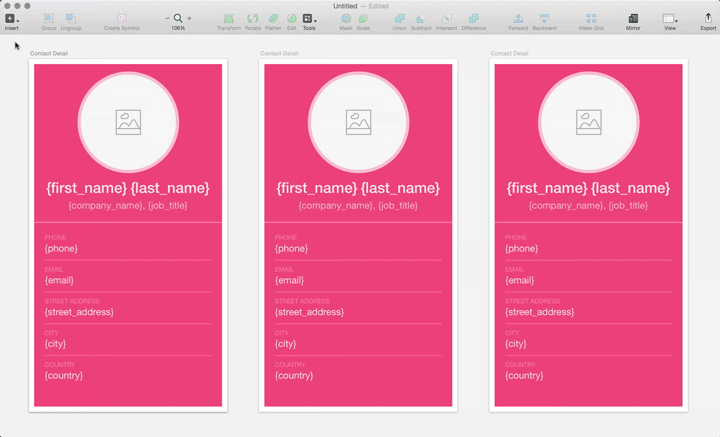
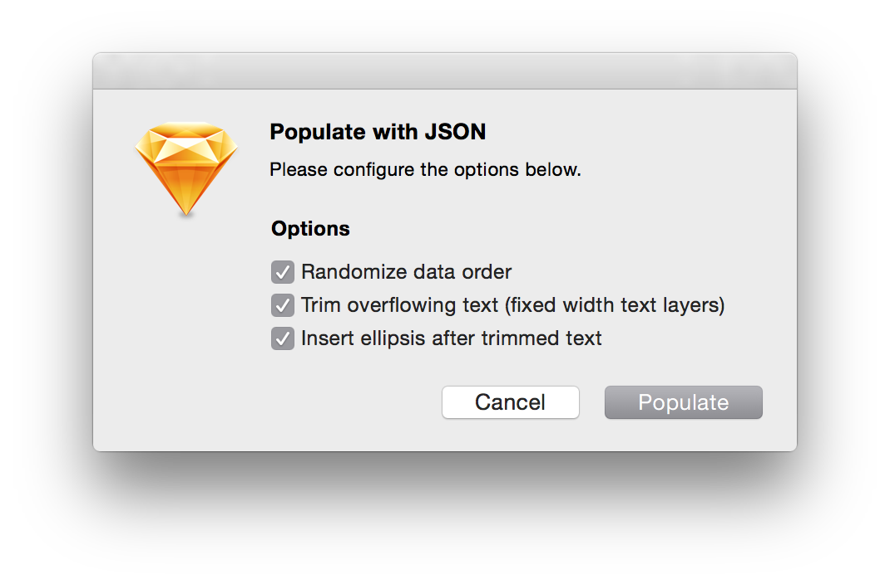
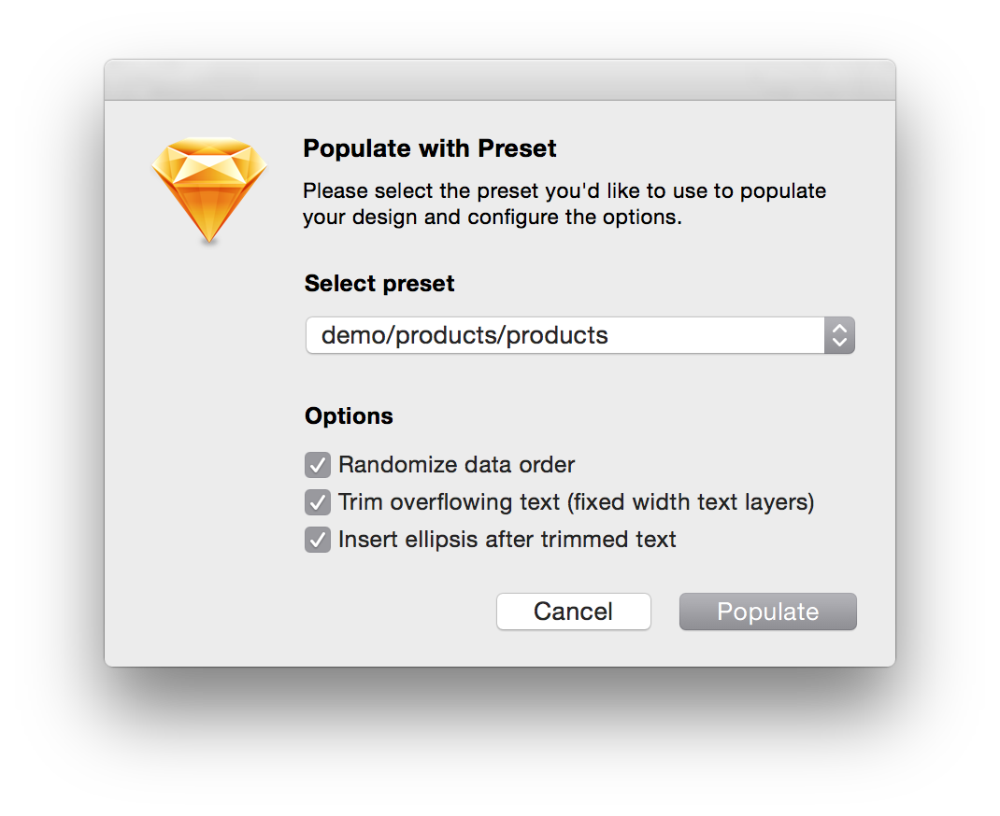

# Sketch Data Populator

## Why Data Populator

We believe designers should work with _meaningful_ data as early as possible in the design process for the following reasons:

1. **Content informs design decisions** (and helps you convey your purpose)
2. **Data are relentless** (so UI components must be designed for robustness)
3. **It's fun** (seeing your design evolve with meaningful data is motivating and rewarding)
 
_Sketch Data Populator_ not only makes you more productive, it changes the way you design user interfaces (at least that's what happened to us).

## Testing & Credits

Please report bugs, observations, ideas & feature requests as [issues](https://github.com/preciousforever/sketch-data-populator/issues).

We conceived _Sketch Data Populator_ to improve our design with data process at [precious design studio](http://precious-forever.com/) and developed the plugin in collaboration with [Lukas Ondrej](https://github.com/lukas77me). Please get in touch if you have questions or comments via [@preciousforever](https://twitter.com/preciousforever) or [our website](http://precious-forever.com/contact).

## Installation
1. Download the ZIP file (or clone repository)
2. Move the file ```Sketch Data Populator.sketchplugin``` into your Sketch Plugins folder. In Sketch 3, choose **Plugins › Reveal Plugins Folder…** to open it.

## How to use …
 
The **Sketch Data Populator** plugin replaces text and image {placeholders} with data: 



### Here's how it works:

1. Create a Layer Group that contains at least one Text Layer. In these Text Layers, use placeholders for you data fields in curly brackets – such as ```{first_name}``` or ```{last_name}```. Within a Text Layer, you can do arbitrary string concatenation such as ```{last_name}, {first_name}```. The plugin's "Populate with …" command will replace all these placeholders with respective data.

2. In the same Layer Group, create a Shape Layer (this is your image placeholder). Give the Shape Layer a placeholder name in curly brackets – such as ```{avatar_image}```. The plugin's "Populate with …" command will replace this placeholder with respective image data (PNG, JPG).

3. Create another Rectangle Layer as your icon placeholder. Give it a placeholder name in double curly brackets, something like ```{{icon}}```. Set any of its properties like size, fill color or shadow as desired – all properties will apply to the final icon once populated. The plugin's "Populate with …" command will replace this placeholder with respective icon vector data (SVG).

### All available Commands:

**Populate with JSON** will ask you to choose a JSON file that can sit anywhere on your Computer. After picking a JSON, you can choose the following options: _Randomize data order_, _Trim overflowing Text (fixed width text layers)_ and _Insert ellipsis after trimmed text_ (selected options will be preserved):



**Populate with Preset** will display a dialog that allows you to select one of your Presets as well as the aforementioned options:



**Populate again** (⌘⇧X) re-populates all selections with the last used Preset/JSON and options configuration. Great for "shuffling" through different data sets.

**Place SVG** will prompt you for picking a SVG asset on your computer. It will replace the selected shape and adapt its properties (like size, color, shadow …).

**Place image** will prompt you for picking an image on your computer and then use it as the background for the selected shape.

**Reveal Presets** will point you into the plugin's location for its Presets. Presets are simply JSON files and folders with image assets that live inside the plugin bundle. In there, you can use any desired folder structure. To find the "Preset" folder inside the plugin bundle, right click _Sketch Data Populator.sketchplugin_ and select _Show Package Contents_.

---

Check out the **demo.sketch** and **demo-population.sketch** files in the **demo** folder to get an idea.

---

### Data format & assets

The data need to be stored in JSON files that can be loaded by the plugin from either the Presets Folder (Populate with Preset) or from any folder on your computer (Populate with JSON). The data in JSON need to be in an array like in this example:

```[
  {
    "id": 1,
    "first_name": "Willie",
    "last_name": "Willis",
    "company_name": "Myworks",
    "job_title": "Marketing Assistant",
    "email": "wwillis0@cdc.gov",
    "phone": "9-(528)011-1428",
    "street_address": "99 Hallows Terrace",
    "city": "Outeiro",
    "country": "Portugal",
    "avatar_image": "assets/1.jpg",
	"icon": "assets/vip.svg"
  },
  {
    "id": 2,
    "first_name": "Melissa",
    "last_name": "Flores",
    "company_name": "Tagtune",
    "job_title": "Actuary",
    "email": "mflores1@jigsy.com",
    "phone": "4-(965)937-9250",
    "street_address": "46 Acker Trail",
    "city": "Santiago",
    "country": "Philippines",
    "avatar_image": "assets/2.jpg",
	"icon": "assets/vip.svg"
  }, …
```

Note that in the example the image file (JPG) and the icon (SVG) are referenced from a folder called _assets_. This means all your image and icon data should be placed inside a folder that sits on the same level as your JSON file. The images/icons folders as well as your images and icons can be named anything you like, you just need to reference them relative to your JSON file.

<sup>The mock data in "demo" were created with https://www.mockaroo.com, which is a pretty powerful tool to generate all kinds of data. The "products" images are from apple.com, the "contacts" images from https://randomuser.me/.</sup>
