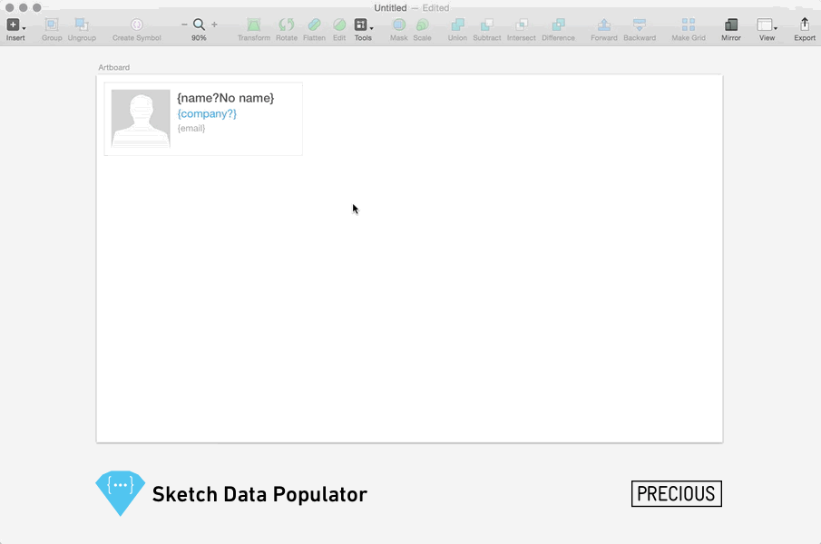
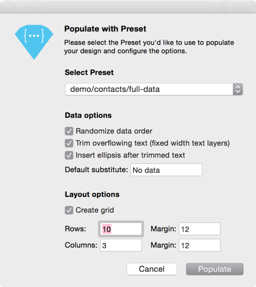
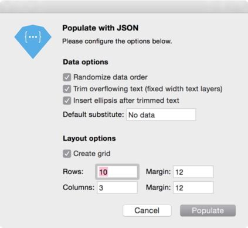

## Why Data Populator

We believe designers should work with _meaningful_ and _realistic_ data as early as possible in the design process for the following reasons:

1. **Content informs design decisions** (and helps you convey your purpose)
2. **Data are relentless** (so UI components must be designed for robustness)
3. **It's fun** (seeing your design evolve with meaningful data is motivating and rewarding)

Read more about [designing with meaningful data](https://medium.com/sketch-app-sources/designing-with-meaningful-data-5456b40e172e#.1mft9hyv2).

_Sketch Data Populator_ not only makes you more productive (probably around [60x faster](https://vimeo.com/131896485)), it changes the way you design user interfaces (at least that's what happened to us).

## How to install
Download the latest version from the [releases page](https://github.com/preciousforever/sketch-data-populator/releases), unzip it and double-click the `Sketch Data Populator.sketchplugin` file to install it in Sketch.

## Testing & Credits

Please report bugs, observations, ideas & feature requests as [issues](https://github.com/preciousforever/sketch-data-populator/issues) or [get in touch](mailto:feedback@datapopulator.com).

We conceived _Sketch Data Populator_ to improve our design process for working with data at [precious design studio](http://precious-forever.com/) and developed the plugin in collaboration with [Lukas Ondrej](https://github.com/lukasondrej). Please get in touch if you have questions or comments via [@preciousforever](https://twitter.com/preciousforever) or [our website](http://precious-forever.com/contact).

It is based on _Sketch Fusion_ by [Andrey Shakhmin, @turbobabr](https://github.com/turbobabr), as presented at [#SketcHHackday 2016](http://designtoolshackday.com).

## How to use

The **Sketch Data Populator** plugin creates a grid from a selected Layer, Layer Group or Artboard and replaces text and image {placeholders} with data from a JSON source:

### Here's how it works:

1. Create a Layer Group that contains at least one Text Layer. In the Text Layer content, use placeholders for you data fields in curly brackets – such as `{firstname}` or `{lastname}`. You can do arbitrary string concatenation such as `{lastname}, {firstname}`. The plugin's "Populate with …" command will replace all these placeholders with respective data. Please note that if your Text Layer is called `{name}` (in the Layer List), the content of the Layer will always be overwritten with the data contained in {name}. So if you use multiple {placeholders} in a Text Layer, you should rename your Layer to something without curly brackets.

2. In the same Layer Group, create a Shape Layer (this is your image placeholder). Give the Shape Layer a placeholder name in curly brackets – such as `{image}`. The plugin's "Populate with …" command will replace this placeholder with respective image data (PNG or JPG).

### Available Commands:

#### Populate with Preset
will display a dialog that allows you to select one of your Presets as well as configure Data and Layout options:

#### Populate with JSON
will ask you to choose a JSON file that can sit anywhere on your Computer. After picking a JSON file, you can configure Data and Layout options:

#### Populate Table
allows to use .csv files (eg. exported from a Google Sheet) to populate complex data structures to complex layer structures. The documentation for this feature is still work in progress.

#### Populate again (pre-configured shortcut: ⌘⇧X)
re-populates all selections with the last used Preset/JSON and options configuration. Great for "shuffling" through different data sets.

#### Clear Layers
restores populated Layers to their initial {placeholders}. An example: you used the placeholders "{firstname} {lastname}" in a Text Layer, they became "John Doe" after populating. "Clear Layers" will restore to "{firstname} {lastname}". This is useful because populating a Text Layer means the initially used {placeholders} will be persisted – so without restoring, it would always try to populate the initial {placeholders}, no matter what you type into the field.

#### Reveal Presets
will point you into the plugin's location for its Presets. Presets are simply JSON files and folders with image assets that live inside the plugin bundle. In there, you can use any desired folder structure. To find the "Preset" folder inside the plugin bundle, right click _Sketch Data Populator.sketchplugin_ and select _Show Package Contents_.

Check out the **demo.sketch** file to get an idea.

---

### Data & Layout Options for the 'Populate with…' commands

**Data options**  
* _Randomize data order_: instead of going through the JSON top down row by row, it will pick a random data set.  
* _Trim overflowing text_: a Text Layer that has been set with a fixed width will trim overflowing text.  
* _Insert ellipsis after trimmed text_: will insert a "…" after the trimmed text.  
* _Default substitute_ (see below)  

**Handling missing data**  

_Text Substitutes_  
`{placeholder}` inserts an empty string if no data are available for placeholder  
`{placeholder?}` uses the _Default substitute_  
`{placeholder?substitute}` uses the custom substitute you append after the "?"

_Image Substitutes_  
If there's no image available, it will turn off the fill of the placeholder shape and turn it on again once there's data available when re-populating. So for images, it's recommended to put a substitute image or pictogram behind the actual image. So this will be visible if there's no actual image data (see "demo.sketch" for examples).

**Layout options**  
If "Create grid" is checked, the plugin will create a grid from selected elements (Layer Groups or Artboards) and populate them in one go. Set the amount of rows and columns and the respective margins. This option works very similar to Sketch's "Make Grid" tool (you can use negative margins, too).

---

### Populating Iconfonts
If you're into using Iconfonts for Icons in Sketch as described [in this article](https://medium.com/sketch-app-sources/a-case-for-iconfonts-in-sketch-f62de0b269b9#.hh80mjnhs), that's a great fit with Data Populator. It is possible because Iconfonts use custom ligatures to trigger certain icons: for example, the string 'heart' is being replaced with a ♥ icon.

To make this happen, simply create an _Auto Width_ Text Layer, choose an appropriate Iconfont and call the Layer `{iconname}` (according to your available Ligatures) in the Layer List. The Layer's content will always be replaced with the {iconname} ligature, triggering the respective icon.

---

### Multiline Text Layers
Usually, populating Text Layers is limited to single lines of text. If you populate an _Auto Width_ Text Layer, it will always expand the width of the Layer and keep it single line. If you populate a _Fixed Width_ Text Layer without the trimming (see above), it will keep that fixed with but always expand the number of lines to fit the available data. If you populate a _Fixed Width_ Text Layer with trimming turned on, it will always truncate the data to a single line – meaning the default max. number of lines is 1.

However, if you want Data Populator to truncate after another defined number of lines, that's also possible. Do this by appending the following to the Layer Name of a Fixed Width Text Layer in Sketch's Layer List:

` | -l n` (where 'n' is your desired number of max. lines)

---

### Filters
By appending your {placeholder} with one of the following available filters, separated by a `|`, you can use certain operations on your populated strings. We will add more filters in the future.

#### UPPERCASE
You can force your data to be UPPERCASE after populating by appending your {placeholder} with `| upper`.
`{name | upper}` will lead to `PETER`.

#### Maximum characters
You can set the maximum number of characters of your {placeholder} by appending it with `| max n`, _n_ representing the desired number of characters.
`{name | max 3}` will lead to `Pet`.

#### Join
Imagine you want to concatenate the keys _name_, _price_, _date_ and _time_ seperated by a `·` (interpunct/middle dot). Usually, you would create a string in a Text Layer like this:  
`{name} · {price} · {date} · {time}`

This works great as long as you have data for each key – like:  
`CursusId.jpeg · $1993.33 · 3.12.2014 · 2:29 PM`

But now imagine there's no data (or substitute) for _price_ and _time_. Which would lead to:  
`CursusId.jpeg ·  · 3.12.2014 · `

That's why there's now a "join" function with the following syntax to be used inside a {placeholder}:  
`{name,price,date,time|& · }`

1. comma separated list of keys
2. `|`
3. `&` followed by a delimiter, eg. ` · ` or `, ` (put _spaces_ where you need them!)

So in our above mentioned example, without data (or substitutes) for _price_ and _time_, it renders like this:  
`CursusId.jpeg · 3.12.2014`

Here's an animated example:

#### Combining Filters
Filters can also be combined or grouped with parentheses within {placeholders}. Here are some examples:
`{firstname | upper | max 3}` = PET (assuming firstname = Peter)  
`{(lastname, firstname | &, ), DateOfBirth | & born on }` = Miller, Peter born on 14.07.1970 (assuming firstname = Peter, lastname = Miller)  
`{(firstname | upper | max 3), (lastname | max 1) | & · }` = PET · M  

---

### Conditional actions
Conditional Actions can be used to execute certain actions within Sketch based on data. This can be done by adding available actions to the Layer Name in the Layer List – for example to show (or hide) a certain Layer based on the used string or the number of characters.

#### Available Actions
`#show[condition]` - shows layer if true and hides otherwise  
`#hide[condition]` - hides layer if true and shows otherwise  
`#lock[condition]` - locks layer if true and unlocks otherwise  
`#unlock[condition]` - unlocks layer if true and locks otherwise  
`#delete[condition]` - deletes the layer if the condition is true  
`#plugin[condition, command path]` - runs the specified plugin command if condition is true (use the command path like this: 'Plugin > Command')  

Examples:  
`#show["{firstname}".length > 3]` - shows layer if {firstname} has more than 3 characters and hides otherwise  
`#show["{firstname}" == "Peter"]` - shows layer if {firstname} is 'Peter' and hides otherwise  
`#show["{firstname}".includes('e')]` – shows layer if {firstname} includes 'e' and hides otherwise  

You can also combine several conditions:  
`#show["{firstname}".includes('e') || "{firstname}".length > 3]` – shows layer if {firstname} includes 'e' and has more than 3 characters, hides otherwise  

Pure _JavaScript_ syntax is being used for _Conditional Actions_, so you can basically use anything available in _JavaScript_.
